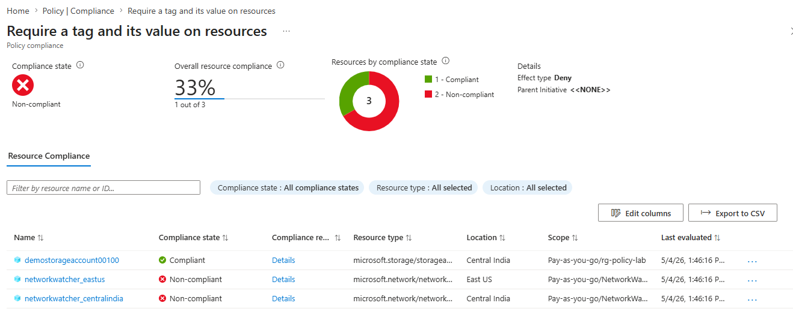

# Lab 10: Azure Policy Compliance

## 🎯 Objective
Deploy and assign Azure Policy definitions to enforce compliance across resources.  
Validate policy effects by testing non‑compliant deployments and reviewing compliance reports.

## ⚙️ Resources Deployed
- Resource Group: rg-policy-lab
- Policy Definition: **Require a tag and its value on resources**
- Policy Assignment: Applied to rg-policy-lab
- Test Storage Account Deployment:
  - **Compliant** (tag applied: `Environment=Lab`)
  - **Non‑compliant** (missing required tag, flagged in compliance report)

## 📸 Screenshots

**Resource Group Creation**  
Created resource group rg-policy-lab.  

**Policy Definition Selection**  
Selected built‑in policy definition “Require a tag and its value on resources.”  

**Policy Assignment**  
Assigned policy to resource group `rg-policy-lab`.  

**Non‑Compliant Storage Account Deployment Attempt**  
Attempted to deploy a storage account without required tag, flagged as non‑compliant.  

**Compliant Storage Account Deployment**  
Deployed a storage account with required tag (`Environment=Lab`), marked compliant.  

**Compliance Report**  
Viewed compliance status in Azure Policy dashboard showing both compliant and non‑compliant resources.  

**📚 Key Learnings & Resume Highlights**

Assigned Azure Policy definitions to enforce compliance at resource group scope.

Validated policy effects by flagging non‑compliant storage accounts.

Reviewed compliance reports to monitor adherence to organizational standards.

Demonstrated governance and compliance management aligned with AZ‑104 domains.
