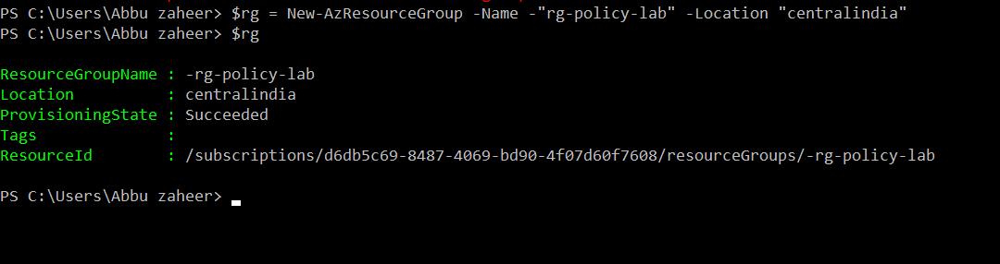
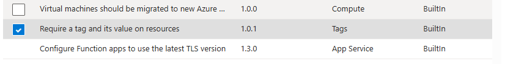
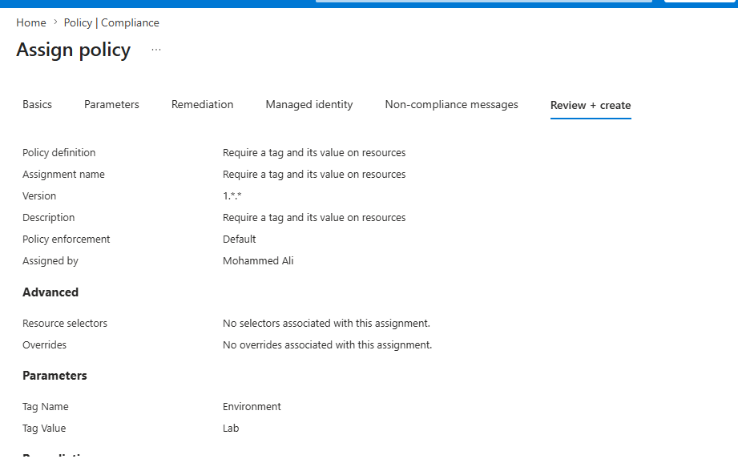
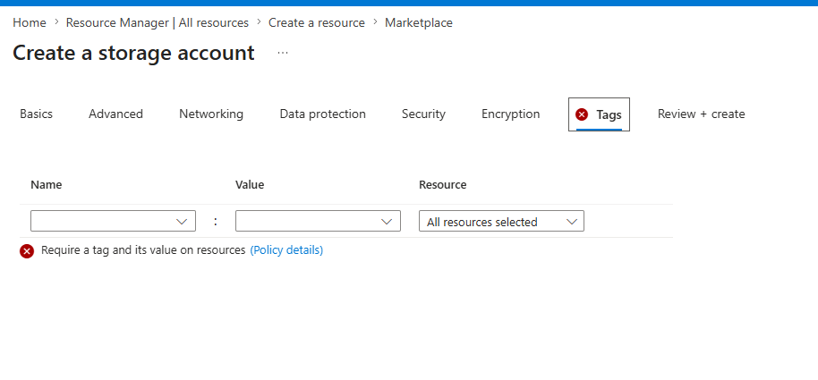
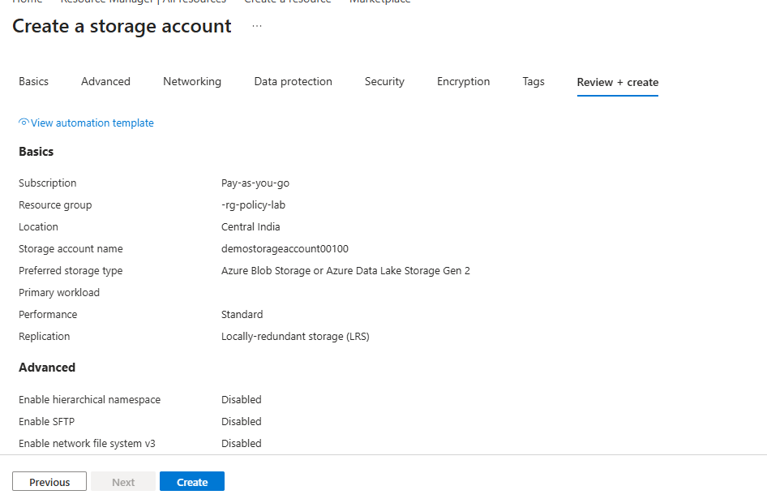

# Lab 10: Azure Policy Compliance

## 🎯 Objective
Deploy and assign Azure Policy definitions to enforce compliance across resources.  
Validate policy effects by testing non‑compliant deployments and reviewing compliance reports.

## ⚙️ Resources Deployed
| Resource Type | Name / Configuration |
|---|---|
| Resource Group | rg-policy-lab |
| Policy Definition | Require a tag and its value on resources |
| Policy Assignment Scope | rg-policy-lab |
| Compliance Validation | Storage account deployments |
| Required Tag | Environment=Lab |
| Governance Platform | Azure Policy |

## 📦 Deployment Scope
This lab focused on implementing Azure governance and compliance controls using Azure Policy.
The deployment included:
- Azure Policy definition selection and assignment
- Resource group scoped compliance enforcement
- Validation of required tagging standards
- Testing compliant and non-compliant resource deployments
- Compliance monitoring through Azure Policy reporting dashboards

## 📸 Deployment Flow & Compliance Validation

**Resource Group Deployment**  
Created the `rg-policy-lab` resource group to scope Azrue Policy assignment and compliance validation.

**Azure Policy Definition Selection**  
Selected the built-in Azure Policy definition `Require a tag and its value on resources` to enforce organizational tagging standards.

**Policy Assignment Configuration**  
Assigned the policy definition at the `rg-policy-lab` resource group scope for compliance enforcement. 

**Non‑Compliant Storage Account Deployment Attempt**  
Validated policy enforcement by attempting a storage account deployment without the required tag, resulting in non-compliance detection.

**Compliant Resource Deployment Validation**  
Successfully deployed a compliant storage account with the required `Environment-lab` tag applied. 

**Compliance Monitoring & Reporting**  
Reviewed Azure Policy compliance reports showing compliant and non-compliant resource evaluation results.

## 📊 Operational Validation
- Successfully assigned Azure Policy definitions at resource group scope.
- Validated policy enforcement against non-compliant resource deployments.
- Confirmed compliant resources passed governance validation requirements.
- Reviewed Azure Policy compliance dashboards and evaluation reporting.
- Demonstrated governance monitoring aligned with Azure administration best practices.

## 📚 Key Learnings
- Learned how Azure Policy enforces governance and compliance standards across resources.
- Understood policy assignment scopes and tagging enforcement mechanisms.
- Validated compliance behavior using compliant and non-compliant resource deployments.
- Gained practical exposure to Azure governance monitoring and compliance reporting.

## 💼 Resume Alignment
- Implemented Azure Policy governance controls for resource compliance enforcement.
- Configured policy assignments and validated tag-based compliance requirements.
- Performed compliance monitoring and reporting using Azure Policy dashboards.
- Demonstrated practical understanding of Azure governance and organizational policy management.

